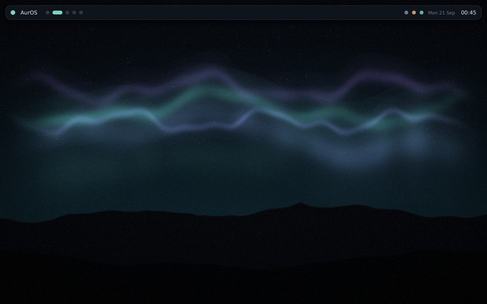

<div align="center">

# AurOS

**A Linux desktop that a non-technical person installs on their old Windows PC
by downloading one file.**

</div>



<sub>Not a mock-up — a screendump of AurOS running in a VM with Secure Boot
**enabled**, `aurshell` painting directly to DRM/KMS.</sub>

---

## What this is

Four things that have to work as one:

| | | |
|---|---|---|
| **AurOS** | the distribution | our init, package manager, desktop shell and theme engine, on an Ubuntu LTS base |
| **AurBridge** | the Windows `.exe` | preflight, consent, repartition, write, boot handoff — the only part that can destroy someone's data |
| **Ferry** | first-boot migration | pulls files and settings off the still-intact Windows partition |
| **Forge** | the customization layer | one declarative profile → a branded, locked-down, localized build |

The goal, stated as a testable contract:

> A person opens a website, downloads one file, double-clicks it, reads and
> agrees to what will happen, and afterwards is sitting in a working,
> good-looking Linux desktop with their own files already there.

## Where it actually is

**Working and verified:**

- **Boots with Secure Boot on.** OVMF with Microsoft's keys → Microsoft-signed
  shim → Canonical-signed GRUB → kernel → `aurshell`. The shim we ship is
  dual-signed (Microsoft UEFI CA **2011** *and* 2023, checked with `sbverify`),
  so it also boots firmware that predates the 2023 CA — which is most of the
  old hardware this exists for.
- **The desktop shell runs**, painting straight to DRM/KMS. No X11, no Wayland
  compositor, no Mesa in that path.
- **Theme engine** — one file drives wallpaper, bar, palette, terminal, TTY,
  GTK and bootloader. Six themes, including a light one.
- **Procedural wallpapers** — generated from the theme, so a reskin never
  strands a stale photo and the image carries no JPEGs.
- **From-scratch TrueType rasterizer** and a PNG encoder with its own DEFLATE.
- **The whole install, end to end, on a synthetic machine.** AurBridge's
  phase engine prepares the machine; one restart lands in the staging
  environment, which shrinks Windows, writes AurOS, verifies it, probes
  the hardware, commits the new partition table in one sector and hands
  over in the same boot. Putting Windows back is tested the same way.
  The numbers are in `docs/PLAN.md` §6 and the transcripts in
  `docs/results/`.
- **Power cuts on purpose** — the installer names its own dangerous
  instants and a fault build stops dead at each one; Windows comes back
  with every file byte-identical every time (`tools/powercuttest.sh`).
- **A no-stick mode**, for test machines: the image is downloaded in
  pieces onto the Windows drive and read after the restart through a
  read-only mount; the way back is kept on the disk. What that gives up
  is in `docs/AURBRIDGE.md`, "Installing without a memory stick", and
  `tools/nosticktest.sh` proves it.
- **Ferry** — read-only NTFS, OneDrive placeholder classification, Firefox
  profile transplant, NetworkManager import, CLDR timezone mapping.
- **Website** — five pages including an honesty page about what can go wrong.

**Not proven yet:** anything on a real PC. The Windows half
(`src/aurbridge/plat_win.c`) has only ever run under Wine and against a
simulated machine, and every install so far has been in QEMU on one
firmware. **Nothing ships until the dry run has been through a fleet of
real machines and failing an install at every phase has been tested on
real hardware.** `docs/RELEASE.md` lists everything between here and a
public download, with who does it and in what order.

**Not a code problem:** a legal entity, a code-signing certificate, a
host for the image and insurance are prerequisites to the first public
download. See `docs/RELEASE.md` and `docs/SIGNING.md`.

## Try it

```sh
sudo ./build/forge build desktop     # bootstrap + package + theme an image
sudo ./build/mkimage desktop         # → out/auros-desktop.img, bootable
```

Boot it with Secure Boot on:

```sh
cp /usr/share/OVMF/OVMF_VARS_4M.ms.fd /tmp/vars.fd
qemu-system-x86_64 -machine q35,smm=on -m 3072 \
  -global driver=cfi.pflash01,property=secure,value=on \
  -drive if=pflash,format=raw,readonly=on,file=/usr/share/OVMF/OVMF_CODE_4M.secboot.fd \
  -drive if=pflash,format=raw,file=/tmp/vars.fd \
  -drive file=out/auros-desktop.img,format=raw,if=virtio \
  -device virtio-gpu-pci
```

Preview the desktop without booting anything:

```sh
aurshell --conf /etc/auros/shell.conf --png /tmp/desktop.png --size 1600 900
```

## Reskin it

This is the part built to be handed to someone else. Edit one file:

```sh
aurora new midnight --from nocturne   # scaffold
$EDITOR /usr/share/auros/themes/midnight.theme
aurora set midnight                   # wallpaper, bar, terminal, TTY, GRUB
```

`aurora` renders every template from the theme and supports a colour algebra,
so derived shades are never hand-written:

```
@accent@              #7DD3C0
@accent|lighten:20@   lighter by 20%
@accent|mix:bg:70@    70% toward the background
@accent|on@           a readable foreground to sit on the accent
@accent|rgba:0.4@     rgba(125,211,192,0.40)
```

Themes inherit, so a variant states only what it changes. See
[`docs/THEMING.md`](docs/THEMING.md).

## Rebrand and lock it down

A profile is the whole customization surface in one file — branding, theme,
locale, app set, policy. What a school ships is data, not code:

```sh
./build/forge build school-kiosk     # one browser, no installs, no console
./build/forge build multilingual     # four languages, input methods, fonts
```

## Repository

```
build/     forge (image builder) · mkimage (bootable image) · aurb (packages)
src/
  aurora/    the theme engine
  aurshell/  the desktop shell — DRM/KMS, rasterizer, compositing
  aurinit/   PID 1 and aurctl
  aurbridge/ the Windows installer: preflight, wizard, phases 0-3
  aurstage/  the staging environment: the install and the way back
  aurfirst/  the first boot: "does it work?", and the only BootOrder writer
  ferry/     first-boot migration off Windows
  recovery/  capture and restore a machine's boot state
  common/    theme parser · wallpaper renderer · font · PNG
profiles/  desktop · school-kiosk · multilingual · office · revive
themes/    nocturne · synthwave · sandstone · moss · ember · slate + templates
docs/      PLAN · RELEASE · AURBRIDGE · STAGEC · SIGNING · THEMING · FERRY · results/ · research/
tools/     the tests; each one exits non-zero when it fails
website/   the download site
```

## Read this before trusting it with a disk

[`docs/research/red-team.md`](docs/research/red-team.md) is an adversarial
review of this product. It is not marketing. It opens by calling the concept
*"a consumer-grade disk-destruction tool with a wizard on it"* unless every
hard stop is implemented, and it is right. Every hard stop it names is a
requirement on AurBridge, and the ones that are implemented carry their
register id in the code.

## Licence

MIT. See [`LICENSE`](LICENSE).
