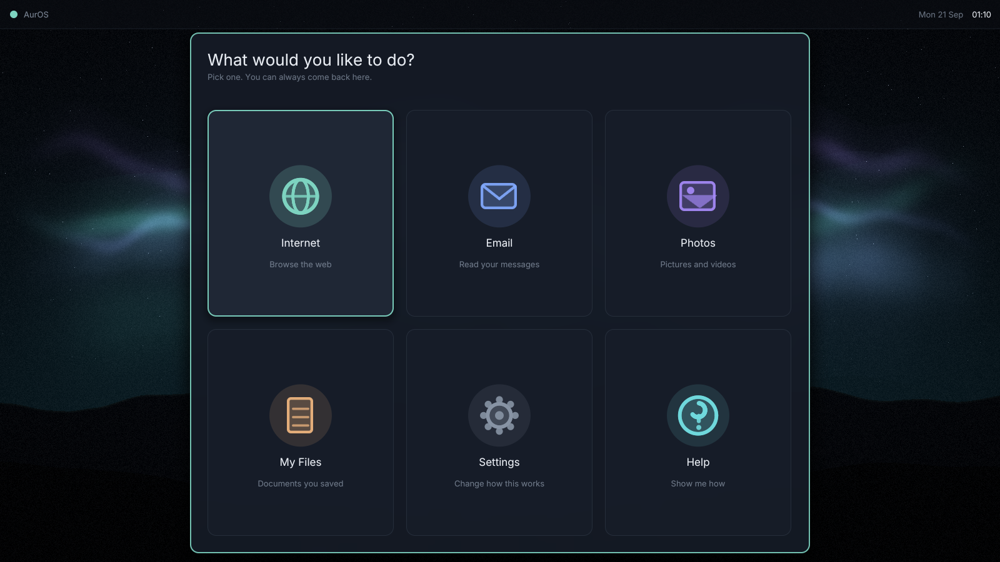
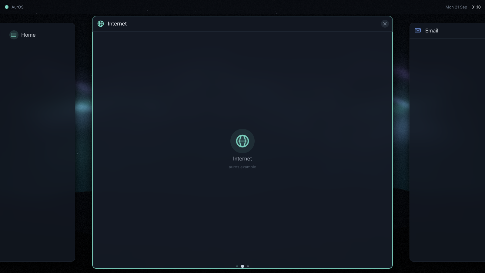
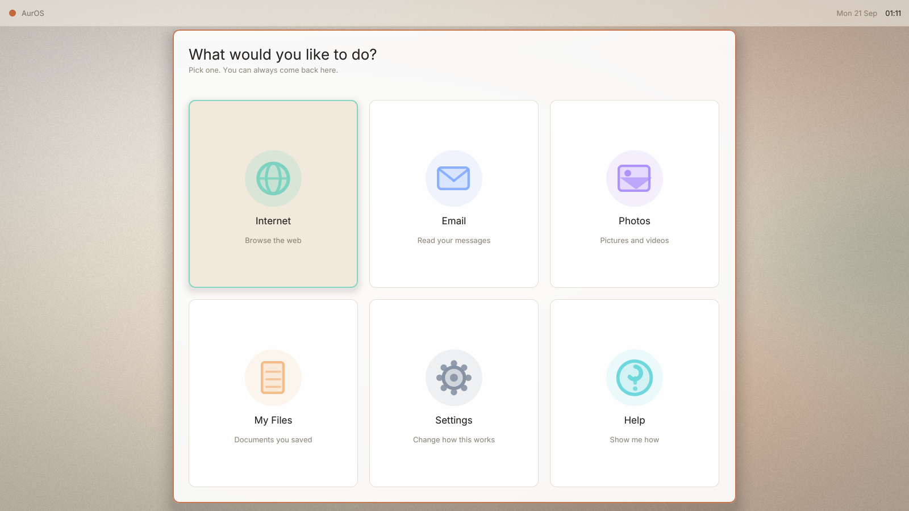

# The AurOS shell — Cards on a Rail

> There is no desktop, no taskbar, no dock, no launcher and no overview.
> Everything you have open is one horizontal row of large cards. The
> far-left card is always Home.

## The problem this solves

Every desktop in existence splits the screen into two layers: **the thing
you are looking at**, and **the machinery for reaching other things** — a
taskbar, a dock, GNOME Activities, or (as AurOS had until now) a bar plus
a command palette.

That second layer is where non-technical people lose things. "It
disappeared." "How do I get back?" "Where did it go?" Minimising,
overlapping windows, alt-tab and hidden overview modes are all ways for
something to exist while being invisible.

The Rail deletes the second layer. **The row is both.** What you can
reach is on screen at all times — at full size, or peeking at the edge.

## The whole model, in two concepts

1. **Cards.** One per thing you are doing. They never overlap, never
   minimise, never hide behind each other.
2. **Left and right.** The focused card is centred; its neighbours peek
   in at both edges. Click a peeking card and it slides to the centre.

That is the entire mental model. It maps onto something the user already
does every day: flipping through photos.

## Why you cannot get lost

- **Home is card 0 and cannot be closed.** It is the end of a line, and
  a line has ends. There is always a leftward direction, and it always
  terminates at Home.
- **Nothing is ever hidden.** If a thing exists, it is on the rail. If it
  is on the rail, it is either on screen or one click from being on
  screen.
- **The dots at the bottom** say how many things are open and which one
  you are on. They are the only chrome that exists purely to orient.
- **The status strip is not a taskbar.** You cannot launch or switch from
  it. It states the time and the machine's name. There is exactly one way
  to move around, so there is no wrong way.
- **Peeking cards carry their label**, anchored to the visible edge — so
  the thing you are being invited to click always says what it is.

## Home

Six tiles, in the words the user actually uses: *Internet*, not "Web
Browser". *My Files*, not "Files". *Help* is a first-class tile, not
something buried in a menu.

Six is deliberate: enough to cover what this person does, few enough to
read without scanning. The tiles are large because they are aimed at by
someone in reading glasses, sometimes with an unsteady hand.

## Prior art, honestly

The closest ancestors are **webOS cards** and the **recents screen** on a
phone. GNOME Activities, Windows Task View and macOS Mission Control are
the same family.

The difference that matters: **all of those are a mode you enter and
leave.** You press a key, a spatial overview appears, you pick something,
it goes away. The mode is itself a thing to get lost inside.

Here the row is the permanent surface. There is no other view to return
to. No shipping Linux desktop does this.

## Rendering

Everything comes from the existing rasterizer — no new primitives:

| Element | Drawn with |
|---|---|
| Cards | rounded rects (signed distance field) + blur behind + soft shadow |
| Depth of off-centre cards | scale and alpha by distance from focus, not 3D |
| Slide | one `tween` on the rail offset, spring-eased |
| Icons | circles, lines and rounded rects on a 24px grid |
| Card contents | `draw_scaled_rounded` — bilinear, so thumbnails do not shimmer while moving |

Icons are drawn from primitives rather than loaded from an icon theme:
they inherit the theme's colours for free, scale to any size without
assets, and add nothing to the image size. Geometric and plain on
purpose — an icon that needs interpreting is a label that failed.

Cost is bounded: at most three cards are ever visible, and the only
per-pixel work is the blur behind each one. Nothing runs over the whole
screen every frame.

## Theming

Entirely theme-driven, like everything else — the same file that sets the
wallpaper sets the card radius, the peek opacity, the tile tints and the
focus ring.

## What is not built yet

Cards currently show a placeholder instead of live application content.
Wiring real windows in means a compositor path for client surfaces; the
card geometry, hit-testing, animation and painting are all done and the
content simply blits into `card.content`.
